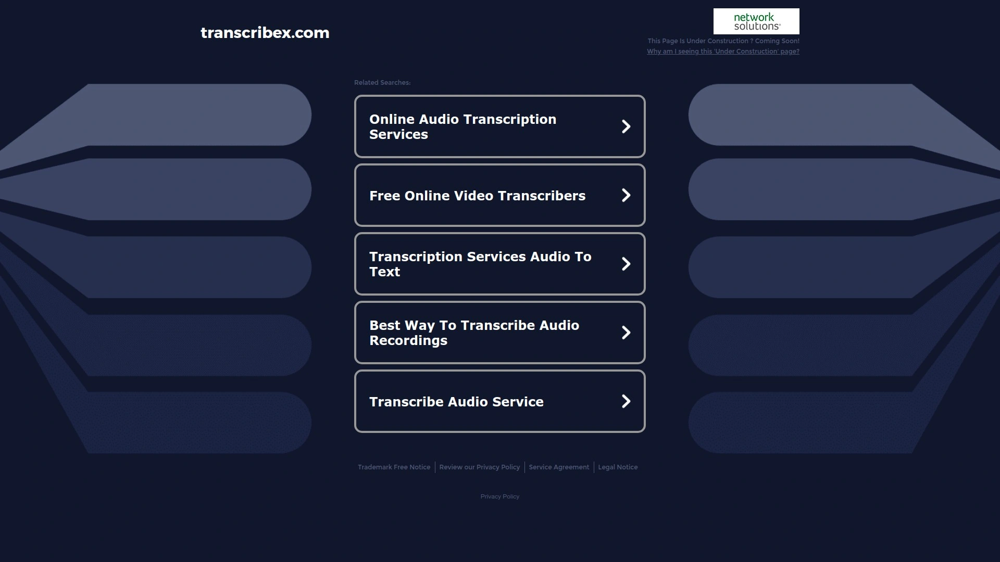

# Top 13 Best AI Subtitle Generators in 2025 (Recently Updated)

Creating videos that grab attention in 2025 is all about accessibility and engagement. With so many people watching content on mute—and creators everywhere needing to reach wider audiences—AI-powered subtitle generators are no longer optional. This curated list dives into the most valuable tools for generating subtitles quickly, accurately, and in multiple languages. Whether you're a marketer, educator, YouTuber, or just someone looking to make their videos pop, there's something here for every workflow. Let’s see which platforms can save you the most time, cost, and frustration—while boosting your content’s reach.

***

## Value Introduction

Video subtitles aren’t just for making your content more accessible—they’re essential for capturing viewers scrolling social media with the sound off. The latest AI subtitle generators can automatically transcribe, translate, and style captions, so your workflow becomes faster and your content reaches a global audience. These AI-driven tools promise less manual labor, more reliability, and broader coverage across languages and video platforms.

***

## Website Card List

## [Submagic](https://www.submagic.co)

Submagic is designed for creators, marketers, and media teams needing dynamic, multi-language subtitles for video content—fast.

The platform automates subtitle generation in over 50 languages, lets you customize style and animation, and even extracts short viral clips with AI. You get features like:

- Instant subtitle generation and translation
- Animated captions, emojis, and on-brand templates
- B-roll, sound effects, and background music built-in
- Auto-cut and trimming for quicker edits
- API and integrations for streamlined publishing

With a focus on scaling up short-form video production, Submagic saves hours for media teams, brands, and social accounts wanting more content with less manual work. No technical experience needed—AI does most of the heavy lifting, from highlight detection to auto-branding.

***

## [BeHooked](https://behooked.co)

All-in-one content creation platform combining subtitle generation with video creation, AI avatars, and hyper-personalization for rapid viral content.

- Perfectly timed subtitles with customizable branding
- Create videos from scripts, include AI-generated voiceovers and avatars
- Live editing via chat, automation for fast turnarounds
- Built to maximize watch time and trend potential, especially for short-form content.

***

## [SuperAGI Caption Pro](https://superagi.com)

Advanced subtitle generation focused on high accuracy and real-time processing.

- Up to 95% accuracy, real-time captions for live streaming and video meetings
- Swarm-based AI learns new accents, industry jargon, and handles complex terminology
- Integrates seamlessly with YouTube, Vimeo, Facebook, Adobe Premiere, and more
- Strong on advanced features like speaker ID, forced alignment, and sentiment analysis for pros.

***

## [Whisper AI Studio](https://openai.com/research/whisper)

Industry leader in AI-powered audio transcription and subtitles, especially in tough audio conditions.

- 100+ language support, impressive accuracy for noisy or multi-speaker audio
- Advanced noise reduction, real-time translation features
- Popular pick for creators who need reliable subtitles beyond English, with strong support for global languages.

***

## [Maestra](https://maestra.ai)

Powerful subtitle generator and real-time captioning platform for global content teams.

- Subtitles in 125+ languages, exportable in SRT, VTT, and other formats
- Real-time captions for live streams, webinars, and video events
- Seamless YouTube and streaming integrations; robust customization for branding
- Customization of fonts and positioning plus voiceover/dubbing features for maximum accessibility.

***

## [Descript](https://www.descript.com)

User-friendly video editor with high-accuracy AI subtitles and translation.

- Auto-generate captions, edit audio/video via text transcript
- 95%+ transcription accuracy, filler word removal, and customizable styles
- Collaboration tools, direct export to YouTube—translation in 20+ languages included
- Free plan with limited usage, with affordable monthly upgrades for pro needs.

***

## [Animaker](https://www.animaker.com)

Animated video creator with automatic subtitle and translation features.

- Generate subtitles instantly in 134 languages
- Add animated effects, customize text, and brand captions to fit any style
- Full manual editing and advanced video creation workflow, including lip-sync AI avatars
- Step-by-step intuitive process, perfect for both pros and beginners.

***

## [VEED](https://www.veed.io)

Browser-based video editor and subtitle tool with strong export and branding options.

- Quick, automated captions—edit fonts, backgrounds, and animation
- Unifies content creation for both short social videos and longer formats
- Simple licensing with watermarked free plan; paid plans unlock full features.

***

## [Checksub](https://www.checksub.com)

Specializes in translation and subtitle scripting, especially for training and global content.

- Fast, AI-powered transcription supporting 187 languages
- Brand kits and ready-made scripts for quick use
- Enterprise-focused with high-volume capacity.

***

## [SubtitleMaster AI](https://subtitlemaster.ai)

Tailored for teams needing audio analysis, speaker recognition, and complex project workflows.

- Advanced speaker detection, sentiment and emotion analysis
- Handles multi-person and specialty content like podcasts, interviews, and accessible captions.

***

## [TranscribeX](https://transcribex.com)

Highly flexible subtitle tool for industry professionals.

- Customizable terminology database, real-time collaboration for large teams
- High accuracy in noisy or multi-speaker environments, with live editing before export.

***

## [Podsqueeze](https://www.podsqueeze.com)

Designed for podcasters and audio creators seeking instant subtitle integration.

- High-accuracy AI for audio subtitle and translation
- Easily convert podcasts for YouTube, TikTok, Instagram
- Export and edit direct from the dashboard.

***

## [UniFab Subtitle Generator AI Cloud](https://unifab.ai/resource/free-subtitle-generator)

Web-based, fast, and free with robust language support.

- Drag-and-drop uploads, instant SRT downloads, 30+ languages
- Clean UI, 30 free credits for testing, focuses on speed and productivity for global communications.

***

# FAQ Common Questions

**Does video length affect subtitle processing speed?**
Larger files and longer videos may take more time, but the top AI subtitle generators now offer fast batch processing and efficient handling for both short and long-form content.

**Can I customize subtitle appearance?**
Yes, most leading platforms let you adjust fonts, colors, placement, and add animation or branding, so captions match your content style.

**How do these tools handle different languages?**
Nearly all top platforms support 20+ languages (some over 100), making it easy to reach international viewers or translate for global distribution.

***

# Conclusion

Choosing the right AI subtitle generator in 2025 means balancing speed, accuracy, global reach, and brand fit. For creators and media teams needing ultra-fast, smart subtitles with strong customization and short-form video tools, [Submagic](https://www.submagic.co) remains hard to beat—especially for scaling viral content and saving hours each week. Take time to try several platforms from this list for your workflow, and see how better subtitles can level up your video presence in any niche.

Why [Submagic](https://www.submagic.co) is suitable for rapid short-form content: its seamless blend of speed, AI automation, and multi-platform publishing options make it the obvious choice for anyone wanting instant, high-performing video captions.

[56](https://skywork.ai/skypage/en/Descript-AI-Review-(2025)-Is-Text-Based-Editing-the-Future/1973805544004841472)
